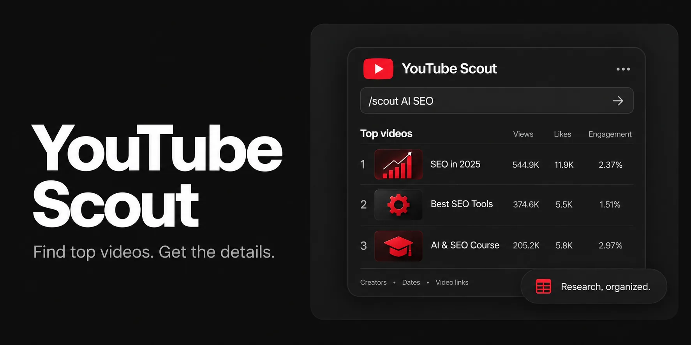
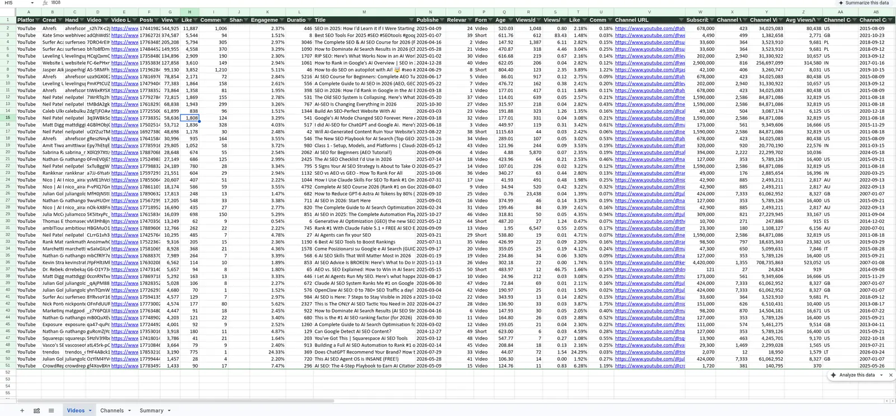

<p align="center">
  
</p>

# youtube-scout

[](https://github.com/AgriciDaniel/youtube-scout/actions/workflows/ci.yml)
[](https://claude.ai/claude-code)
[](LICENSE)
[](CHANGELOG.md)
[](tests/)
[](https://www.skool.com/ai-marketing-hub-pro)

**One topic in, one ranked YouTube research workbook out.** Type `/scout matcha recipe` in
Claude Code and get an `.xlsx` with the most relevant videos ranked by performance, the
creators behind them, what the audience says in the comments, the opening lines that hooked
viewers, and the moments people replay.

> Not affiliated with, sponsored by, or endorsed by YouTube or Google. YouTube and Google product
> names are trademarks of their owners.

## Why youtube-scout

- **Everything the public API exposes, in one sheet.** 48 columns per video: views, likes,
  comments, engagement, views per day, views per subscriber, format, category, tags, language,
  captions, paid promotion flag, channel size and country, and more. No field left on the table.
- **Signals you cannot get from the YouTube UI.** Breakout ratio (views per subscriber),
  momentum (views per day), the top comment per video, hook text from captions, and replay
  hotspots from the "most replayed" curve, the closest public proxy for retention.
- **Fits an existing research sheet.** The first columns match a social ads tracking layout, so
  `--into your-sheet.xlsx` appends YouTube rows next to TikTok and Instagram rows, dedups by
  video id, re-sorts, and keeps your manual columns and hyperlinks intact.

## What you get

| Sheet | Contents |
|---|---|
| Videos | One row per video. Identity, performance, channel context, metadata, and (with flags) top comment, hook, replay hotspots. |
| Channels | One row per creator in the sample: subscribers, channel totals, country, videos in sample, sample views, average engagement, best video. Your outreach list. |
| Summary | Topic, filters, quota used, totals, median and mean views, Shorts share, paid promotion share, top channels, top tags, categories, languages, countries. |
| Comments | With `--comments`: top N comments per video with likes and reply counts. |
| Transcripts | With `--hooks` or `--transcribe`: hook text and full transcript per video, with its source (captions or Whisper). |

<p align="center">
  
</p>

## Installation

No GitHub account is needed to install.

### Manual install (Unix, macOS, Linux)

```bash
git clone https://github.com/AgriciDaniel/youtube-scout.git
cd youtube-scout
./install.sh            # copies the skill to ~/.claude/skills/scout
python3 -m pip install --user openpyxl
python3 -m pip install --user yt-dlp    # optional, for --hooks, --download, and --transcribe
```

`./install.sh --target codex`, `--target agents`, `--target portable`, or `--target all`
install to other agent runtimes. `./uninstall.sh` removes it.

### Plugin install (Claude Code)

```
/plugin marketplace add AgriciDaniel/youtube-scout
/plugin install youtube-scout@agricidaniel-youtube-scout
```

### API key

Create a YouTube Data API v3 key in Google Cloud Console, restrict it to that API, then either
export it or put it in a key file:

```bash
export YOUTUBE_API_KEY=...            # for the session
# or
mkdir -p ~/.config/scout && chmod 700 ~/.config/scout
printf 'YOUTUBE_API_KEY=...\n' > ~/.config/scout/.env && chmod 600 ~/.config/scout/.env
```

`SCOUT_ENV_FILE=/path/to/keys.env` points the skill at any other env file.

## Quick start

```
/scout matcha recipe
/scout iced matcha latte --since month --length short --max 100
/scout ai seo --comments --hooks
/scout ai seo --comments --hooks --transcribe --download 10
/scout matcha recipe --into OWT-Social-Ads.xlsx
/scout matcha recipe --sort breakout --dry-run
```

Each run prints a top-10 table and writes `scout-<topic>-<date>.xlsx` in the current folder.

## Flags

| Flag | Default | Meaning |
|---|---|---|
| `--max N` | 50 | Videos to collect, 1 to 200. Each block of 50 uses one of your 100 daily searches. |
| `--since` | any | `hour`, `today`, `week`, `month`, `year`, `any` |
| `--length` | any | `short` (under 4 min), `medium` (4 to 20), `long` (over 20) |
| `--sort` | views | `views`, `engagement`, `likes`, `recent`, `momentum` (views per day), `breakout` (views per subscriber) |
| `--comments [N]` | off | Top N comments per video (default 20). 1 quota unit per video. |
| `--hooks [SECONDS]` | off | yt-dlp probe: hook text (first SECONDS of captions, default 15), vertical, FPS, replay hotspots, chapters, full transcript. No quota. |
| `--out PATH` | `./scout-<topic>-<date>.xlsx` | Write a new workbook |
| `--into PATH` | off | Append into an existing workbook, dedup by video id, re-sort, backup first |
| `--download [N]` | off | Save thumbnails for every video and mp4s for the top N (all when N is omitted) into `./downloads/` |
| `--transcribe [MODEL]` | off | Transcribe audio locally with Whisper for videos without caption transcripts (default model `turbo`, GPU recommended). Fills Hook, Transcript Words, and the Transcripts sheet. No quota, no caption requests. |
| `--dry-run` | off | Fetch and print only |
| `--json` | off | Also print rows as JSON |

## Sample output

`/scout ai seo`, 50 videos, one search call:

```
 #        Views   Eng %     V/day   V/Sub      Len  Fmt   Handle               Title
 1      544,925    2.37     1,048     0.8     7:26  Video ahrefscom            SEO in 2025: How I'd Learn it if I Were Starting O
 2      374,587    1.51       612    83.4     0:08  Short webhivedigital       Best SEO Tools For 2025 #SEO #SEOtools #googlerank
 3      205,208    2.97     1,387     6.1    50:46  Video surferseo            The Complete SEO & AI SEO Course for 2026 (Full Be
 4      149,955    3.29       318     4.5    18:10  Video surferseo            How to Dominate AI Search Results in 2026 (ChatGPT
 5      134,896    2.30       219     0.7    28:27  Video levelingupofficial   RIP SEO: Here's What Works Now in an AI World
```

The Summary sheet for that run reported 14% Shorts, a median length of 12 minutes, and a
creator with 4,490 subscribers whose 8-second Short reached 375,000 views (views per
subscriber 83). Those are the rows worth studying.

## Architecture

```
topic
  |  search.list (relevance, paginated, 1 of 100 daily search calls per 50)
  v
video ids
  |  videos.list (snippet, statistics, contentDetails, status, topicDetails,
  |               recordingDetails, paidProductPlacementDetails, liveStreamingDetails)
  |  channels.list (snippet, statistics, topicDetails, brandingSettings)
  |  videoCategories.list
  v
rows  --sort-->  Videos / Channels / Summary sheets
  |  --comments: commentThreads.list per video (1 unit each)
  |  --hooks:    yt-dlp -j per video, json3 captions, heatmap peaks (no quota, cached)
  |  --transcribe: local Whisper on the downloaded file or fetched audio (no quota, cached)
  v
scout-<topic>-<date>.xlsx   or   --into existing.xlsx
```

Engagement % is (likes + comments) / views. Views per day uses the video age with a floor of
six hours. Format is Short when a video is 180 seconds or less and not confirmed horizontal.

## Quota and limits

- Since June 2026 the API uses granular quota buckets: 100 `search.list` calls a day, plus
  10,000 units a day for everything else. A default 50-video run uses 1 search call and
  3 units; adding `--comments` adds 1 unit per video. The run prints what it used.
- YouTube blocks caption downloads per IP after bursts (HTTP 429), and the block can last
  several hours. The skill paces requests, retries with backoff, caches probes under
  `~/.cache/scout/` for 7 days, and stops trying after one hard failure. `--transcribe` fills
  the gaps by transcribing the audio locally with Whisper, which never touches the caption
  endpoint. The Transcript Source column says which rows came from captions and which from
  Whisper.
- Full video downloads can be slow when YouTube throttles them. `--download 10` saves mp4s for
  the top 10 only, plus thumbnails for every row.
- yt-dlp breaks whenever YouTube changes something. `yt-dlp -U` usually fixes it within a day.
  Metadata columns still fill when captions fail.

## Limitations

- Shares, click-through rate, impressions, retention, and demographics are not available for
  other people's videos through any API. The replay heatmap is the closest public proxy.
- AI Disclosure is in the API documentation but is rarely returned for public videos.
- Search relevance is not deterministic; two runs of the same topic can differ by a few videos.
- Append mode rewrites the Videos sheet body. Charts or images on that sheet would not survive.
  A timestamped backup is written first, and the file must be closed in Excel.

## FAQ

**Does it need OAuth?** No. An API key is enough for everything the skill reads.

**Can I use it on my own channel's analytics?** No. Retention and traffic sources live in
YouTube Analytics, which is a different API and out of scope.

**Why are Shares and Spark Code blank?** They are manual columns from the social ads sheet
layout. YouTube exposes no share count. They only appear in `--into` mode.

**Where do the workbooks go?** The current directory. They contain third-party creator data,
so the repository ignores `*.xlsx` and you should not commit them anywhere.

## Requirements

- Python 3.10 or newer, openpyxl.
- A YouTube Data API v3 key.
- yt-dlp on PATH for `--hooks`, `--download`, and `--transcribe`.
- ffmpeg on PATH for `--download` (it merges video and audio) and for `--transcribe`.
- For `--transcribe`: `openai-whisper` with a CUDA GPU (fast), or `faster-whisper` on CPU (slower).

## Uninstall

```bash
./uninstall.sh            # or --target all
rm -rf ~/.cache/scout     # optional: the probe cache
```

## Contributing

See `CONTRIBUTING.md`. Tests are offline; run `python -m pytest` and `ruff check .`.
No em dashes, no keys, no workbooks in commits.

## Security

See `SECURITY.md`. Keys are read from the environment or a key file you name and are never
logged.

## License

MIT. See `LICENSE`.

## Author

[Daniel Agrici](https://agricidaniel.com/about):
[Blog](https://agricidaniel.com/blog) ·
[AI Marketing Hub (free)](https://www.skool.com/ai-marketing-hub) ·
[AI Marketing Hub Pro](https://www.skool.com/ai-marketing-hub-pro) ·
[YouTube](https://www.youtube.com/@AgriciDaniel) ·
[GitHub](https://github.com/AgriciDaniel)

## Community

Questions, ideas, and results: https://www.skool.com/ai-marketing-hub-pro
